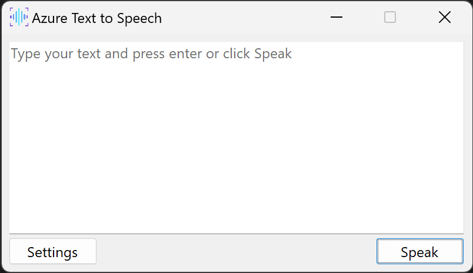
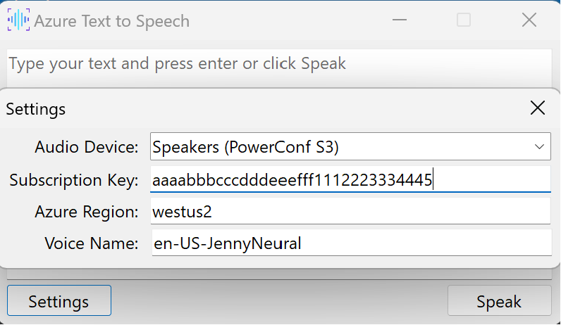
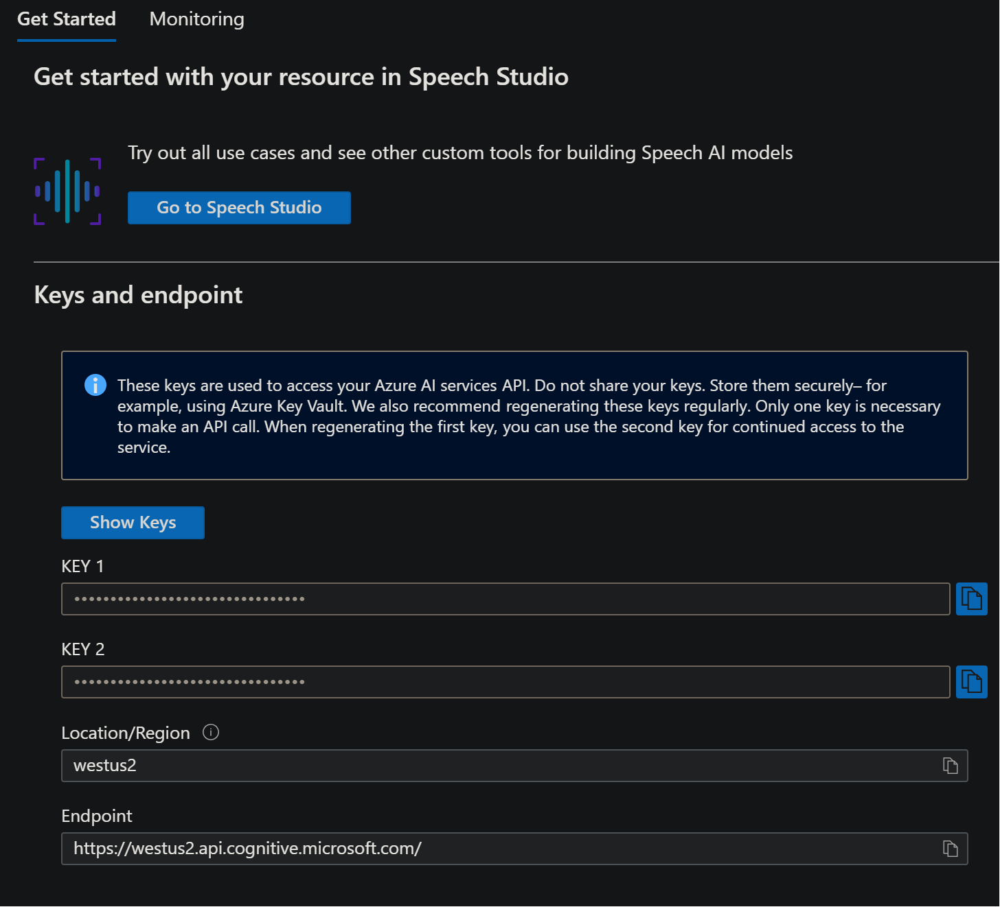

# Azure Text to Speech UI

(c) Copyright 2024 Jessica Mulein, Digital Defiance.
This application is not produced or sanctioned by Microsoft and is intended only as a demonstrator app for Azure Neural Text to Speech.



## Setup and Configuration

* First, ensure you've created a Speech resource in Azure Portal or the Speech Studio
  * [Azure AI services - Microsoft Azure](https://portal.azure.com/#view/Microsoft_Azure_ProjectOxford/CognitiveServicesHub/~/SpeechServices)
  * [Speech Studio (microsoft.com)](https://speech.microsoft.com/portal)
* Upon launch, click the Settings button in the lower left.

​	

* Select the audio output device where you would like the audio sent
* Enter the subscription key- this can be found in the Azure Portal in the Speech resource you created, click "Show Keys"

	

* Ensure the region in the settings box matches the region in the azure portal.
* Enter a voice name, from the Speech Portal's Voice Gallery. The exact string is most easily found if you view the sample code for C# and copy the value from the line ```config.SpeechSynthesisVoiceName = "en-US-AvaNeural";``` taking just the part inside the quotes.

From there, you should be able to just close the settings- they will save automatically as they are edited.

Next you should be able to type into the box and press enter to hear your speech, or click the Speak button.

Shift+Enter will prevent the text from clearing itself.  
